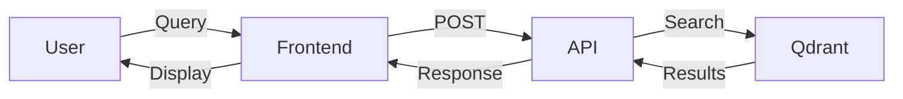

# Diagram Creation Guidelines

Guidelines for creating effective diagrams in documentation.

## ASCII Diagrams

### Pipeline/Flow Diagrams

Use ASCII art for simple data flows:

```
Input → Processing → Output
```

```
┌─────────┐    ┌──────────┐    ┌────────┐
│ Source  │ -> │ Transform│ -> │ Result │
└─────────┘    └──────────┘    └────────┘
```

Multi-stage pipelines:

```
Stage 1: Filter      Stage 2: Extract     Stage 3: Index
    ↓                     ↓                     ↓
  ripgrep    →       Drain3         →       Qdrant
(pre-filter)      (templates)          (vector DB)
```

### Architecture Diagrams

Show component relationships:

```
┌─────────────────────────────────────┐
│           Client Browser            │
└────────────┬────────────────────────┘
             │
      ┌──────▼───────┐
      │ Nginx :40901 │
      └──┬────────┬──┘
         │        │
  ┌──────▼──┐  ┌─▼────────┐
  │ React   │  │ Flask API│
  │  SPA    │  │  :5000   │
  └─────────┘  └─┬────┬───┘
                 │    │
            ┌────▼┐  ┌▼─────┐
            │Qdrant│ │Redis │
            └──────┘ └──────┘
```

### Decision Trees

Show conditional logic:

```
Feature Type?
    ├─ New Feature
    │   ├─ Create docs/features/<NAME>.md
    │   ├─ Add to FEATURES.md
    │   └─ Update README.md
    │
    ├─ Modified Feature
    │   ├─ Update docs/features/<NAME>.md
    │   └─ Update FEATURES.md (if capability changed)
    │
    └─ Bug Fix
        └─ Update feature doc (if behavior changed)
```

## UI Mockups

Use box-drawing characters for UI mockups:

```
┌──────────────────────────────────────────────────┐
│ Feature Name                              [×]    │
├──────────────────────────────────────────────────┤
│                                                  │
│ Input Field: [_____________________________]    │
│                                                  │
│ ☑ Option 1                                      │
│ ☐ Option 2                                      │
│ ☐ Option 3                                      │
│                                                  │
│                        [Cancel]  [Submit]       │
└──────────────────────────────────────────────────┘
```

Table-like interfaces:

```
┌────────────┬──────────┬─────────┬─────────┐
│ Name       │ Status   │ Count   │ Actions │
├────────────┼──────────┼─────────┼─────────┤
│ Pattern 1  │ Active   │ 123     │ [Edit]  │
│ Pattern 2  │ Inactive │ 45      │ [Edit]  │
│ Pattern 3  │ Active   │ 789     │ [Edit]  │
└────────────┴──────────┴─────────┴─────────┘
```

## Sequence Diagrams

Show interaction between components:

```
User          Frontend       API           Database
  │               │           │               │
  ├─ Click ──────>│           │               │
  │               ├─ POST ───>│               │
  │               │           ├─ Query ──────>│
  │               │           │<── Result ────┤
  │               │<─ 200 ────┤               │
  │<─ Display ────┤           │               │
```

## State Diagrams

Show state transitions:

```
[Initial] ──upload──> [Processing] ──success──> [Completed]
                           │
                           └──error──> [Failed]
                                          │
                                      [Retry] ──> [Processing]
```

## Box-Drawing Characters Reference

For creating ASCII diagrams:

```
Corners:
┌ ┐ └ ┘  (rounded)
╔ ╗ ╚ ╝  (double)

Lines:
─ │ ┼    (single)
═ ║ ╬    (double)

Arrows:
→ ← ↑ ↓  (arrows)
▼ ▲ ► ◄  (triangles)
```

## Best Practices

1. **Keep it Simple**
   - ASCII diagrams should be simple
   - Complex diagrams → use tools (draw.io, mermaid)

2. **Consistent Width**
   - Use 60-80 characters max
   - Fits in code blocks without scrolling

3. **Label Everything**
   - Add labels to boxes
   - Show data flowing between components

4. **Use Whitespace**
   - Don't cram too much
   - Use blank lines for readability

5. **Test Rendering**
   - Preview in markdown viewer
   - Check in both light/dark themes

## Mermaid Diagrams

For complex diagrams, use Mermaid (if supported):



## When to Use External Tools

Use external diagram tools (draw.io, Lucidchart) for:
- Complex architecture diagrams
- Entity-relationship diagrams
- Detailed system designs
- Screenshots needed

Export as PNG and embed:
```markdown

```

Store images in `docs/images/` folder.
