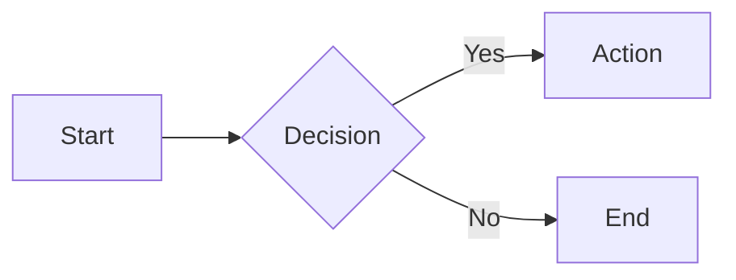

# Screenshot Guidelines

Guidelines for creating and maintaining screenshots in documentation.

## When to Include Screenshots

**DO include screenshots for:**
- New UI features
- Complex user interfaces
- Multi-step workflows
- Visual results (charts, graphs)
- Admin panels and settings

**DON'T include screenshots for:**
- Simple text output
- API responses (use code blocks)
- Single buttons or form fields
- Frequently changing UIs

## Screenshot Standards

### File Format
- **Format:** PNG (lossless)
- **Max width:** 1200px
- **Max file size:** 500KB (optimize if larger)

### Location
Store in `docs/images/features/`:
```
docs/images/features/
├── semantic-search-ui.png
├── telemetry-dashboard.png
└── cpe-overview.png
```

### Naming Convention
- Use kebab-case: `feature-name-screen.png`
- Be descriptive: `telemetry-export-dialog.png`
- Include variant: `dashboard-dark-theme.png`

## Taking Screenshots

### Preparation
1. **Clean test data** - Use realistic but clean data
2. **Consistent window size** - 1280x800 or 1920x1080
3. **Remove sensitive info** - No real IPs, MACs, credentials
4. **Light theme by default** - Unless showing theme feature

### Cropping
- Crop to relevant area only
- Include context (navigation, headers)
- Remove browser chrome unless needed
- Leave small margin (10-20px) around UI

### Annotations
If adding annotations:
- Use red boxes/arrows sparingly
- Add numbered steps for workflows
- Keep text readable (min 14pt)
- Use consistent colors

## Embedding in Markdown

### Basic Embed
```markdown

```

### With Caption
```markdown
**Figure 1: Telemetry Dashboard**

*The dashboard displays real-time telemetry with interactive charts*
```

### Side-by-Side Comparison
```markdown
| Before | After |
|--------|-------|
|  |  |
```

## Updating Screenshots

### When to Update
- Feature UI changed significantly
- Screenshots show old design
- Data/examples are outdated
- Broken or missing images

### Maintenance Checklist
- [ ] Remove old screenshot file
- [ ] Take new screenshot with same naming
- [ ] Update markdown references if filename changed
- [ ] Optimize file size
- [ ] Verify rendering in docs

## Optimization

### Tools
- **ImageOptim** (Mac) - Lossless compression
- **TinyPNG** (Web) - PNG compression
- **Squoosh** (Web) - Modern formats

### Commands
```bash
# Optimize PNG
pngquant image.png --output image-optimized.png

# Resize large image
convert image.png -resize 1200x image-resized.png
```

## Alternatives to Screenshots

### When to Use Alternatives

**ASCII UI mockups** - For simple layouts
```
┌─────────────────────────┐
│ Dialog Title      [×]   │
├─────────────────────────┤
│ Content here            │
│ [Cancel]    [OK]        │
└─────────────────────────┘
```

**Code blocks** - For API responses
```json
{
  "result": "data"
}
```

**Mermaid diagrams** - For flowcharts


**Videos/GIFs** - For interactions (use sparingly)
- Keep under 5MB
- Max 10 seconds
- Store in `docs/videos/`

## Checklist Before Committing

- [ ] Screenshot is clear and readable
- [ ] No sensitive information visible
- [ ] File size under 500KB
- [ ] Stored in correct directory
- [ ] Referenced correctly in markdown
- [ ] Alt text is descriptive
- [ ] Renders properly in preview

## Example Documentation Section

```markdown
## Dashboard Interface

The telemetry dashboard provides real-time metrics visualization:


**Key elements:**
1. **Time range selector** (top right) - Choose analysis period
2. **Metric cards** - Summary statistics for quick overview
3. **Interactive charts** - Hover for detailed values
4. **Export button** - Download data as CSV

The dashboard auto-refreshes every 30 seconds when viewing live data.
```
