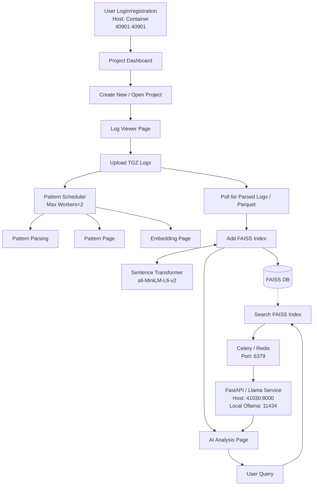

<p align="center">
    <br>
    
    </br>
</p>

## Table of Contents
- [parsemylog-AI](#parsemylog-ai)
- [introduction](#introduction)
- [Getting Started](#getting-started)
  - [Installation](#installation)
- [Architecture](#architecture)
  - [Login \& Project Management](#login--project-management)
    - [Upload Logs](#upload-logs)
    - [Pattern Parsing](#pattern-parsing)
    - [Embedding \& Indexing](#embedding--indexing)
    - [AI Analysis](#ai-analysis)
  - [🧱 Tech Stack](#-tech-stack)

# parsemylog-AI
LogAI helps you analyze, organize, and query log data intelligently using AI-powered insights.
It combines pattern detection, vector search (FAISS), and local Llama inference into a unified workflow.

# introduction
# Getting Started
## Installation

```shell

# Check out rdk_one3b code repo from Github
git clone https://github.com/Arumugam-panchatcharam/parsemylog-ai.git
cd parsemylog-ai

# [Optional] Create virtual environment
python3 -m venv venv
source venv/bin/activate

# install dependencies
pip install -r requirements.txt

# make sure to add current root to PYTHONPATH
export PYTHONPATH='.'
python3 logai/gui/application.py # Run local plotly dash server.

```

# Architecture

## Login & Project Management
Create or open a project from the dashboard.
Each project keeps its own uploaded logs, parsed data, and AI results.

### Upload Logs
Upload .tgz log files from CMS or local storage.
Files are extracted and queued for parsing automatically.

### Pattern Parsing
Background workers (via Celery + Redis) detect recurring log patterns.
Status updates are streamed live in the UI.

### Embedding & Indexing
Parsed logs are converted into vector embeddings using Sentence-Transformer (all-MiniLM-L6-v2) and indexed with FAISS.
Enables ultra-fast semantic search.

### AI Analysis
User queries trigger FAISS similarity search and are sent to local Llama (through FastAPI + Ollama).
The model explains or summarizes log patterns in natural language.

## 🧱 Tech Stack
  * Frontend: Dash + Plotly + Bootstrap
  * Backend: FastAPI + Celery + Redis
  * AI Engine: Local Ollama (Llama 3)
  * Vector DB: FAISS
  * Embedding Model: all-MiniLM-L6-v2

