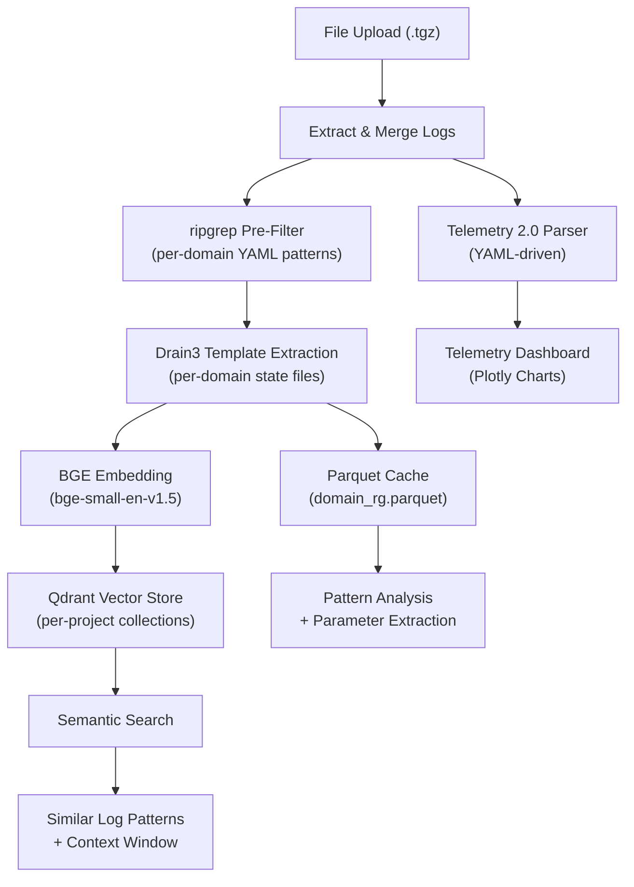

# ParseMyLog-AI

A Dash-based web application for RDK log analysis with semantic search powered by a **rg+Drain3 RAG pipeline** and **Qdrant vector database**.

## Features

- **File Upload & Extraction** -- Drag-and-drop RDK log tarballs (.tgz/.tar.gz); automatic extraction and chronological merging.
- **rg+Drain3 Pipeline** -- Two-stage log indexing: ripgrep pre-filters error-class lines (6-10x speedup), then Drain3 extracts templates per domain.
- **Semantic Search** -- BGE embeddings (BAAI/bge-small-en-v1.5) stored in Qdrant for cosine similarity search across log patterns.
- **Telemetry 2.0 Dashboard** -- YAML-driven parsing of T2 periodic reports with key metric trends, interactive Plotly charts, radio/SSID status cards, and device info (WAN type, SDK version, SW upgrade detection).
- **Log Viewer** -- Paginated viewer with syntax highlighting, regex search, and quick-pattern buttons (ERROR, WARN, IP, Time).
- **Pattern Analysis** -- Drain3 template extraction with frequency analysis, per-domain file filtering, and on-demand parameter extraction via Drain3 native API.
- **AI Analysis** -- Semantic search with matching loglines, dynamic parameter extraction, and log context window with source file back-referencing.
- **Multi-User Support** -- Flask-Login authentication, per-project isolation, thread-safe indexing with per-project locks.

## Architecture


```mermaid
flowchart TD
    Upload["File Upload (.tgz)"] --> Extract["Extract & Merge Logs"]
    Extract --> RgScan["ripgrep Pre-Filter\n(per-domain YAML patterns)"]
    RgScan --> Drain3["Drain3 Template Extraction\n(per-domain state files)"]
    Drain3 --> Parquet["Parquet Cache\n(domain_rg.parquet)"]
    Drain3 --> Embed["BGE Embedding\n(bge-small-en-v1.5)"]
    Embed --> Qdrant["Qdrant Vector Store\n(per-project collections)"]
    Extract --> Telemetry["Telemetry 2.0 Parser\n(YAML-driven)"]
    Telemetry --> Dashboard["Telemetry Dashboard\n(Plotly Charts)"]
    Qdrant --> Search["Semantic Search"]
    Search --> Results["Similar Log Patterns\n+ Context Window"]
    Parquet --> PatternPage["Pattern Analysis\n+ Parameter Extraction"]
```

### Pipeline Details

| Stage | Component | Description |
|-------|-----------|-------------|
| 1. Upload | `gui/callbacks/log_viewer.py` | Drag-and-drop file upload; files stored with original filenames |
| 2. Extract | `gui/log_merger.py` | Tarball extraction, timestamp-based chronological merging |
| 3. Pre-filter | `logai/rg_scanner.py` | ripgrep scans with domain YAML pattern packs; per-domain file glob filtering |
| 4. Templates | `logai/pattern.py` | Drain3 online log parsing with per-domain persistent state files |
| 5. Embed | `logai/embedding.py` | BGE embeddings via SentenceTransformers; deterministic UUIDs for deduplication |
| 6. Store | Qdrant (Docker) | Per-project vector collections with cosine similarity |
| 7. Search | `gui/callbacks/ai_analysis.py` | Semantic similarity search with source file context hydration |
| 8. Telemetry | `logai/telemetry_parser.py` | T2 JSON report parsing with YAML field config |
| 9. Info | `logai/info_extractor.py` | SW upgrade detection and device info extraction |

## Tech Stack

| Component | Technology |
|-----------|------------|
| Web Framework | Dash 3.x + Flask |
| UI Styling | Dash Bootstrap Components |
| Log Parsing | Drain3 (online template mining) |
| Pre-filtering | ripgrep (rg) |
| Embeddings | SentenceTransformers (BAAI/bge-small-en-v1.5, 384-dim) |
| Vector Database | Qdrant |
| Data Processing | pandas, PyArrow (parquet caching) |
| Charts | Plotly |
| Authentication | Flask-Login + bcrypt |
| Database | SQLite + SQLAlchemy |
| WSGI Server | Gunicorn (8 workers, `--preload`) |
| Reverse Proxy | Nginx |
| Containerization | Docker Compose |

## Installation

### Prerequisites

- Docker and Docker Compose
- OR Python 3.11+ with ripgrep installed

### Docker (Recommended)

```bash
# Clone the repository
git clone <repo-url> && cd parsemylog-ai

# Create environment file from the template
cp .env_example .env
# Edit .env if needed (APP_PORT, NGINX_PORT, QDRANT_URL, LOG_LEVEL)

# Build and start all services
docker compose up -d --build
```

This starts three services:
- **rdk-logai-app** -- Main application (Gunicorn on port 40901)
- **qdrant** -- Vector database (port 6333)
- **nginx** -- Reverse proxy (port configurable via `NGINX_PORT`)

### Local Development

```bash
# Install ripgrep
# macOS: brew install ripgrep
# Ubuntu: apt-get install ripgrep

# Create virtual environment
python -m venv .venv && source .venv/bin/activate

# Install dependencies
pip install -r requirements.txt

# Start Qdrant only (required for vector search)
docker compose up qdrant -d

# Run the development server (with hot-reload)
python run_dev.py
```

`run_dev.py` automatically:
- Adds the project root to `sys.path`
- Sets `QDRANT_URL=http://localhost:6333`
- Configures logging at INFO level
- Starts Dash in debug mode with hot-reload on port 40901

## Logging

### Production (Docker)

Application logging is configured in `logai_wsgi.py` and writes to stdout, which Gunicorn captures and forwards to `docker logs`.

```bash
# View logs in real-time
docker compose logs -f rdk-logai-app

# View only the last 100 lines
docker compose logs --tail 100 rdk-logai-app
```

The log level is controlled by the `LOG_LEVEL` environment variable in `.env`:

```bash
# .env
LOG_LEVEL=INFO    # Options: DEBUG, INFO, WARNING, ERROR
```

To temporarily enable debug logging without editing `.env`:

```bash
# Override at runtime
docker compose run -e LOG_LEVEL=DEBUG rdk-logai-app
```

Gunicorn is also configured with `--access-logfile -` and `--error-logfile -` to emit its own access and error logs to stdout.

### Local Development

`run_dev.py` configures logging at INFO level automatically. To change:

```bash
# Set before running
export LOG_LEVEL=DEBUG
python run_dev.py
```

### Log Format

All application logs follow this format:

```
HH:MM:SS [module.name] LEVEL: message
```

Example:
```
14:32:10 [logai.indexer] INFO: [RagIndexer] Processing domain=platform
14:32:11 [logai.rg_scanner] INFO: [RgScanner] Domain 'platform' (66 files): 23468 matches in 0.210s
```

Noisy third-party loggers are suppressed by default:
- `drain3.template_miner` -- set to WARNING (suppresses per-cluster state saves)
- `httpx` -- set to WARNING (suppresses Qdrant HTTP request/response lines)

## Configuration

### ripgrep Pattern Packs

Domain-specific patterns are defined in `configs/rg_patterns/*.yaml`:

```
configs/rg_patterns/
├── wifi.yaml        # WiFi/wireless log patterns
├── platform.yaml    # System/kernel/boot patterns
├── core_router.yaml # WAN/WebPA/Parodus patterns
├── cellular.yaml    # LTE/5G modem patterns
└── mesh.yaml        # Mesh networking patterns
```

Each YAML file defines:
- **domain**: Domain identifier
- **files**: Glob patterns for log files to scan (only matching files are indexed per domain)
- **literals**: Fast literal string matches (e.g., "Segmentation fault")
- **regex**: Regex patterns (e.g., `\b(error|fail)\b`)

### Telemetry Field Configuration

`configs/telemetry_report_fields.yaml` controls which TR-181 fields are extracted and plotted:

- **profile_filter**: Which T2 profile to extract from (default: "Advanced_dynamic")
- **field_groups**: Groups of fields with type, unit, and plot settings
- **{N} expansion**: Multi-instance fields auto-expand (e.g., Radio.1, Radio.2)

### Drain3 Configuration

`drain3.ini` controls the log template mining behavior:
- **sim_th**: Similarity threshold for template matching (default: 0.5)
- **depth**: Parse tree depth (default: 8)
- **max_clusters**: Maximum number of templates (default: 1024)
- **masking**: Custom masking tokens (THREADID, IP, NUM, MAC, DATETIME, etc.)

Drain3 state is persisted per-domain (e.g., `drain3_platform.json`, `drain3_wireless.json`) to prevent cross-domain corruption.

## Project Structure

```
parsemylog-ai/
├── gui/                        # Dash/Flask web application
│   ├── app_instance.py         # App factory, DB init, model loading
│   ├── application.py          # Main Dash app with routing
│   ├── file_manager.py         # File upload/processing pipeline
│   ├── log_merger.py           # Tarball extraction & merging
│   ├── user_db_mngr.py         # User/project database manager
│   ├── callbacks/              # Dash callbacks (business logic)
│   │   ├── ai_analysis.py      # Semantic search + log context callbacks
│   │   ├── pattern.py          # Pattern analysis + file filter callbacks
│   │   ├── log_viewer.py       # File upload, viewer, async indexing
│   │   ├── telemetry.py        # Telemetry dashboard callbacks
│   │   ├── embedding.py        # Embedding pipeline callbacks
│   │   └── utils.py            # Shared callback utilities
│   └── pages/                  # Page layouts
│       ├── log_viewer.py       # Log viewer layout
│       ├── pattern.py          # Pattern analysis layout
│       ├── telemetry.py        # Telemetry page layout
│       ├── ai_analysis.py      # AI analysis layout
│       └── highlighter.py      # Syntax highlighting utilities
│
├── logai/                      # Core log analysis library
│   ├── rg_scanner.py           # ripgrep pre-filtering engine
│   ├── pattern.py              # Drain3 template extraction + parameter API
│   ├── indexer.py              # RAG indexer (rg → Drain3 → embed → Qdrant)
│   ├── embedding.py            # Qdrant vector store + BGE embeddings
│   ├── telemetry_parser.py     # Telemetry 2.0 report parser
│   ├── info_extractor.py       # SW upgrade + device info extraction
│   └── utils/constants.py      # Application constants
│
├── configs/                    # Configuration files
│   ├── rg_patterns/            # ripgrep domain pattern YAMLs
│   └── telemetry_report_fields.yaml
│
├── docker-compose.yml          # Docker services (app + qdrant + nginx)
├── Dockerfile                  # App container (Python 3.11 + ripgrep)
├── drain3.ini                  # Drain3 parser configuration
├── requirements.txt            # Python dependencies
├── logai_wsgi.py               # Production WSGI entry point (logging config)
├── run_dev.py                  # Local development server runner
├── .env                        # Environment variables (not committed)
├── .env_example                # Environment variable template
└── docs/
    └── USER_GUIDE.md           # UI user guide
```

## Environment Variables

| Variable | Default | Description |
|----------|---------|-------------|
| `APP_PORT` | `40901` | Application port |
| `NGINX_PORT` | `8091` | Nginx reverse proxy port |
| `QDRANT_URL` | `http://localhost:6333` | Qdrant server URL (`http://qdrant:6333` in Docker) |
| `LOG_LEVEL` | `INFO` | Python log level: `DEBUG`, `INFO`, `WARNING`, `ERROR` |
| `TOKENIZERS_PARALLELISM` | `false` | Suppress HuggingFace tokenizer fork warnings in Gunicorn workers |

A template is provided in `.env_example`:

```bash
cp .env_example .env
```

## Multi-User & Multi-Project Safety

The indexing pipeline is designed for concurrent multi-user operation:

- **Per-project locks** -- A `threading.Lock` per project ID prevents concurrent indexing of the same project
- **Per-domain Drain3 state** -- Each domain gets its own `drain3_{domain}.json` file, so corruption in one doesn't affect others
- **Atomic file writes** -- `status.json` and parquet caches use `os.replace()` for crash-safe writes
- **Per-project Qdrant collections** -- Named `project_{project_id}` for complete isolation
- **Resume indexing** -- If indexing is interrupted, missing domains are automatically re-indexed when the project is opened
- **Empty domain markers** -- Domains with no matching files get an empty parquet marker to prevent infinite retry loops
- **Project cleanup** -- Deleting a project removes Qdrant collections, Drain3 state files, parquets, and the project folder

## License

See [LICENSE](LICENSE) for details.
