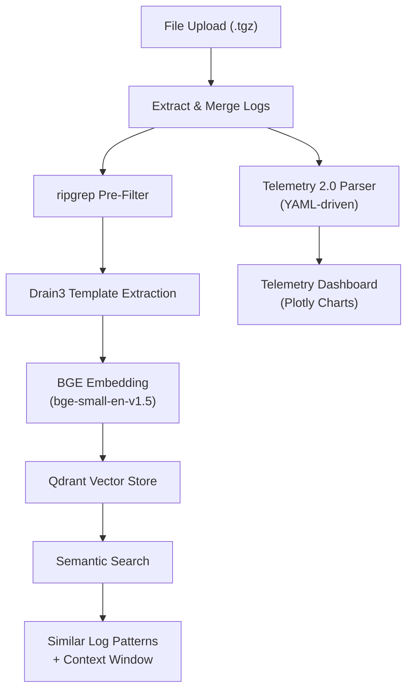

# ParseMyLog-AI

A Dash-based web application for RDK log analysis with semantic search powered by a **rg+Drain3 RAG pipeline** and **Qdrant vector database**.

## Features

- **File Upload & Extraction** -- Drag-and-drop RDK log tarballs (.tgz/.tar.gz); automatic extraction and chronological merging.
- **rg+Drain3 Pipeline** -- Two-stage log indexing: ripgrep pre-filters error-class lines (6-10x speedup), then Drain3 extracts templates.
- **Semantic Search** -- BGE embeddings (BAAI/bge-small-en-v1.5) stored in Qdrant for cosine similarity search across log patterns.
- **Telemetry 2.0 Dashboard** -- YAML-driven parsing of T2 periodic reports with interactive Plotly charts for WiFi, memory, CPU, DSL, and more.
- **Log Viewer** -- Paginated viewer with syntax highlighting, regex search, and quick-pattern buttons (ERROR, WARN, IP, Time).
- **Pattern Analysis** -- Drain3 template extraction with frequency analysis and parameter extraction.
- **Multi-User Support** -- Flask-Login authentication, project management, admin panel.

## Architecture


```mermaid
flowchart TD
    Upload["File Upload (.tgz)"] --> Extract["Extract & Merge Logs"]
    Extract --> RgScan["ripgrep Pre-Filter"]
    RgScan --> Drain3["Drain3 Template Extraction"]
    Drain3 --> Embed["BGE Embedding\n(bge-small-en-v1.5)"]
    Embed --> Qdrant["Qdrant Vector Store"]
    Extract --> Telemetry["Telemetry 2.0 Parser\n(YAML-driven)"]
    Telemetry --> Dashboard["Telemetry Dashboard\n(Plotly Charts)"]
    Qdrant --> Search["Semantic Search"]
    Search --> Results["Similar Log Patterns\n+ Context Window"]
```

### Pipeline Details

| Stage | Component | Description |
|-------|-----------|-------------|
| 1. Upload | `gui/callbacks/log_viewer.py` | Drag-and-drop file upload with progress bar |
| 2. Extract | `gui/log_merger.py` | Tarball extraction, timestamp-based chronological merging |
| 3. Pre-filter | `logai/rg_scanner.py` | ripgrep scans with domain YAML pattern packs |
| 4. Templates | `logai/pattern.py` | Drain3 online log parsing with persistent state |
| 5. Embed | `logai/embedding.py` | BGE embeddings via SentenceTransformers |
| 6. Store | Qdrant (Docker) | Per-project vector collections with cosine similarity |
| 7. Search | `gui/callbacks/ai_analysis.py` | Semantic similarity search with context hydration |
| 8. Telemetry | `logai/telemetry_parser.py` | T2 JSON report parsing with YAML field config |

## Tech Stack

| Component | Technology |
|-----------|------------|
| Web Framework | Dash 3.x + Flask |
| UI Styling | Dash Bootstrap Components |
| Log Parsing | Drain3 (online template mining) |
| Pre-filtering | ripgrep (rg) |
| Embeddings | SentenceTransformers (BAAI/bge-small-en-v1.5, 384-dim) |
| Vector Database | Qdrant |
| Data Processing | pandas, PyArrow (parquet caching) |
| Charts | Plotly |
| Authentication | Flask-Login + bcrypt |
| Database | SQLite + SQLAlchemy |
| WSGI Server | Gunicorn (8 workers) |
| Reverse Proxy | Nginx |
| Containerization | Docker Compose |

## Installation

### Prerequisites

- Docker and Docker Compose
- OR Python 3.11+ with ripgrep installed

### Docker (Recommended)

```bash
# Clone the repository
git clone <repo-url> && cd parsemylog-ai

# Create environment file
cp .env.example .env
# Edit .env to set APP_PORT, NGINX_PORT, QDRANT_URL

# Build and start all services
docker compose up -d --build
```

This starts three services:
- **rdk-logai-app** -- Main application (Gunicorn on port 40901)
- **qdrant** -- Vector database (port 6333)
- **nginx** -- Reverse proxy (port 80)

### Local Development

```bash
# Install ripgrep
# macOS: brew install ripgrep
# Ubuntu: apt-get install ripgrep

# Create virtual environment
python -m venv venv && source venv/bin/activate

# Install dependencies
pip install -r requirements.txt

# Start Qdrant (required for vector search)
docker run -d -p 6333:6333 -v ./qdrant_storage:/qdrant/storage qdrant/qdrant

# Set environment variables
export QDRANT_URL=http://localhost:6333
export APP_PORT=40901

# Run the application
gunicorn -w 4 -b 0.0.0.0:40901 --timeout 360 logai_wsgi:server
```

## Configuration

### ripgrep Pattern Packs

Domain-specific patterns are defined in `configs/rg_patterns/*.yaml`:

```
configs/rg_patterns/
├── wifi.yaml        # WiFi/wireless log patterns
├── platform.yaml    # System/kernel/boot patterns
├── core_router.yaml # WAN/WebPA/Parodus patterns
├── cellular.yaml    # LTE/5G modem patterns
└── mesh.yaml        # Mesh networking patterns
```

Each YAML file defines:
- **domain**: Domain identifier
- **files**: Glob patterns for log files to scan
- **literals**: Fast literal string matches (e.g., "Segmentation fault")
- **regex**: Regex patterns (e.g., `\b(error|fail)\b`)

### Telemetry Field Configuration

`configs/telemetry_report_fields.yaml` controls which TR-181 fields are extracted and plotted:

- **profile_filter**: Which T2 profile to extract from (default: "Advanced_dynamic")
- **field_groups**: Groups of fields with type, unit, and plot settings
- **{N} expansion**: Multi-instance fields auto-expand (e.g., Radio.1, Radio.2)

### Drain3 Configuration

`drain3.ini` controls the log template mining behavior:
- **sim_th**: Similarity threshold for template matching (default: 0.5)
- **depth**: Parse tree depth (default: 8)
- **max_clusters**: Maximum number of templates (default: 1024)

## Project Structure

```
parsemylog-ai/
├── gui/                        # Dash/Flask web application
│   ├── app_instance.py         # App factory, DB init, model loading
│   ├── application.py          # Main Dash app with routing
│   ├── file_manager.py         # File upload/processing pipeline
│   ├── log_merger.py           # Tarball extraction & merging
│   ├── callbacks/              # Dash callbacks (business logic)
│   │   ├── ai_analysis.py      # Semantic search callbacks
│   │   ├── embedding.py        # Indexing pipeline callbacks
│   │   ├── log_viewer.py       # File upload & viewer callbacks
│   │   └── telemetry.py        # Telemetry dashboard callbacks
│   └── pages/                  # Page layouts
│       ├── log_viewer.py       # Log viewer layout
│       ├── telemetry.py        # Telemetry page layout
│       └── ai_analysis.py      # AI analysis layout
│
├── logai/                      # Core log analysis library
│   ├── rg_scanner.py           # ripgrep pre-filtering engine
│   ├── pattern.py              # Drain3 template extraction
│   ├── indexer.py              # RAG indexer (rg+Drain3 pipeline)
│   ├── embedding.py            # Qdrant vector embeddings
│   ├── telemetry_parser.py     # Telemetry 2.0 parser
│   └── utils/constants.py      # Application constants
│
├── configs/                    # Configuration files
│   ├── rg_patterns/            # ripgrep domain pattern YAMLs
│   ├── telemetry_report_fields.yaml
│   └── config_list.json        # Parser config index
│
├── docker-compose.yml          # Docker services (app + qdrant + nginx)
├── Dockerfile                  # App container (Python + ripgrep)
├── drain3.ini                  # Drain3 parser configuration
├── requirements.txt            # Python dependencies
└── logai_wsgi.py               # WSGI entry point
```

## Environment Variables

| Variable | Default | Description |
|----------|---------|-------------|
| `APP_PORT` | `40901` | Application port |
| `NGINX_PORT` | `80` | Nginx proxy port |
| `QDRANT_URL` | `http://localhost:6333` | Qdrant server URL |
| `EMBEDDING_MODEL_PATH` | (auto-download) | Local path to BGE model |

## License

See [LICENSE](LICENSE) for details.
