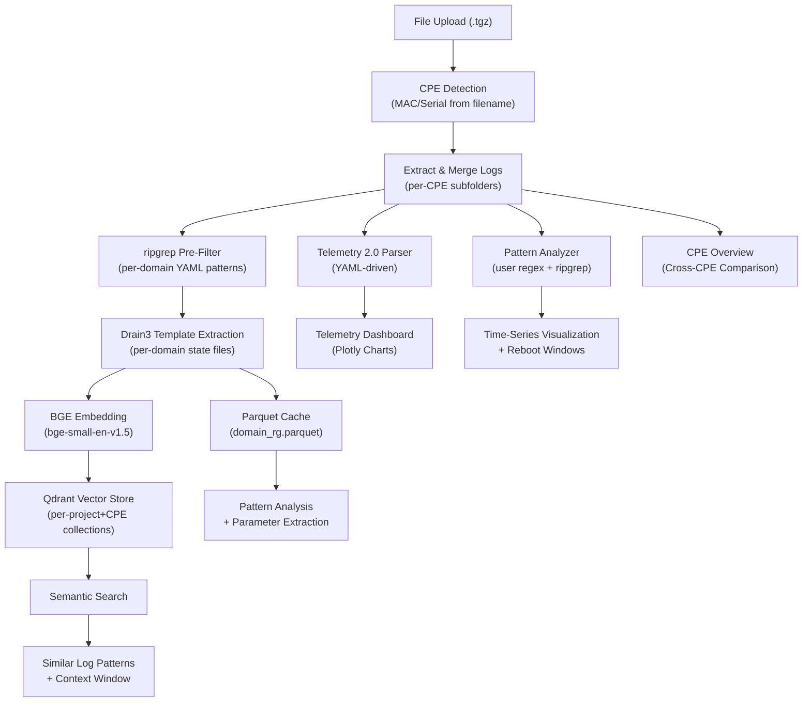

# ParseMyLog-AI

A modern web application for log analysis with semantic search powered by a **rg+Drain3 RAG pipeline** and **Qdrant vector database**. Features a **React** frontend with Material Design, a **Flask REST API** backend, multi-CPE support, and a NATCO-based pattern governance system.

## Features

### Core Analysis
- **File Upload & Extraction** -- Drag-and-drop log tarballs (.tgz/.tar.gz); automatic extraction, MAC/serial detection, and chronological merging.
- **rg+Drain3 Pipeline** -- Two-stage log indexing: ripgrep pre-filters error-class lines (6-10x speedup), then Drain3 extracts templates per domain.
- **Semantic Search** -- BGE embeddings (BAAI/bge-small-en-v1.5) stored in Qdrant for cosine similarity search across log patterns.
- **Telemetry Dashboard** -- YAML-driven parsing of T2 periodic reports with key metric trends, interactive Plotly charts, radio/SSID status cards, and device info.
- **Log Viewer** -- IDE-style paginated viewer with syntax highlighting (timestamps, IPs, MACs, modules, keywords), regex search, and quick-pattern buttons.
- **Pattern Analysis (Drain3)** -- Drain3 template extraction with frequency analysis, per-domain file filtering, and on-demand parameter extraction.
- **AI Analysis** -- Semantic search with matching loglines, dynamic parameter extraction, and log context window.

### Multi-CPE Support
- **Per-CPE Processing** -- Upload multiple tarballs; each CPE (identified by MAC/serial from filenames) is extracted and processed independently under `SERIAL_OR_MAC` subfolders.
- **CPE Selector** -- All pages (Log Viewer, Pattern, Telemetry, AI Analysis) include a CPE selector to switch context.
- **CPE Overview Page** -- Cross-CPE comparison dashboard showing device info, reboot counts, error pattern distribution by domain, and telemetry metric comparisons with interactive Plotly charts.

### Pattern Governance (NATCO System)
- **Global Pattern Configurations** -- Admin defines per-country (NATCO) pattern sets (e.g., EU, DE, PL) to account for different SW versions and deployments.
- **Per-Project NATCO Assignment** -- Each project can be assigned a NATCO at creation or later from the Pattern Analyzer page.
- **Full Override** -- Users get a copy of global patterns they can freely edit, add new patterns, and enable/disable individually.
- **Diff-Based Submissions** -- Users compare their local patterns against global and selectively submit only new or modified patterns for admin review.
- **Admin Review & Merge** -- Admin reviews submissions with clear NEW/MODIFIED labels, can approve (auto-merges into global) or reject with comments.
- **Submission History** -- Collapsible per-user submission history with status tracking and option to clear resolved (approved/rejected) entries.
- **Import Support** -- Admin can seed patterns from preset YAML configs or import from JSON/YAML files (supports domain-grouped, flat array, and `rule_parser_config.json` formats).

### Pattern Analyzer (ripgrep)
- **Regex Pattern Management** -- Create, edit, import/export user-defined regex patterns organized by domain.
- **ripgrep Scanning** -- High-speed regex scanning across all log files with per-CPE support.
- **Time-Series Visualization** -- Pattern occurrences plotted over time with reboot boundary markers.
- **Reboot Window Filtering** -- Select start/end reboot boundaries and use a slider to zoom into specific time ranges.
- **Sync from Global** -- Pull latest NATCO global patterns into local project configuration.

### Multi-User & Admin
- **JWT Authentication** -- Stateless tokens with automatic refresh, per-project isolation.
- **Admin Dashboard** -- Tabbed interface with user management, NATCO management (CRUD + pattern editor), and pattern submission review.
- **Default Admin** -- Auto-created `admin`/`admin123` account on first startup.

## Architecture

```
                    ┌─────────────────────────────────────┐
                    │          Nginx (port 8091)           │
                    │    React SPA  ←→  /api proxy        │
                    └──────┬─────────────────┬────────────┘
                           │                 │
                  Static files         API requests
                           │                 │
                ┌──────────▼──┐    ┌─────────▼──────────┐
                │  React SPA  │    │  Flask REST API     │
                │  (Vite)     │    │  (Gunicorn)         │
                │  Port: 80   │    │  Port: 5000         │
                └─────────────┘    └─────────┬──────────┘
                                             │
                              ┌──────────────┼──────────────┐
                              │              │              │
                    ┌─────────▼──┐  ┌────────▼───┐  ┌──────▼──────┐
                    │  SQLite    │  │  Qdrant    │  │  File Store │
                    │  (Users/   │  │  (Vectors) │  │  (Uploads)  │
                    │  Projects/ │  │  Port 6333 │  │  per-CPE    │
                    │  NATCOs)   │  │            │  │             │
                    └────────────┘  └────────────┘  └─────────────┘
```

### Pipeline


```mermaid
flowchart TD
    Upload["File Upload (.tgz)"] --> CPE["CPE Detection\n(MAC/Serial from filename)"]
    CPE --> Extract["Extract & Merge Logs\n(per-CPE subfolders)"]
    Extract --> RgScan["ripgrep Pre-Filter\n(per-domain YAML patterns)"]
    RgScan --> Drain3["Drain3 Template Extraction\n(per-domain state files)"]
    Drain3 --> Parquet["Parquet Cache\n(domain_rg.parquet)"]
    Drain3 --> Embed["BGE Embedding\n(bge-small-en-v1.5)"]
    Embed --> Qdrant["Qdrant Vector Store\n(per-project+CPE collections)"]
    Extract --> Telemetry["Telemetry 2.0 Parser\n(YAML-driven)"]
    Telemetry --> Dashboard["Telemetry Dashboard\n(Plotly Charts)"]
    Qdrant --> Search["Semantic Search"]
    Search --> Results["Similar Log Patterns\n+ Context Window"]
    Parquet --> PatternPage["Pattern Analysis\n+ Parameter Extraction"]
    Extract --> RegexScan["Pattern Analyzer\n(user regex + ripgrep)"]
    RegexScan --> TimeSeries["Time-Series Visualization\n+ Reboot Windows"]
    Extract --> Overview["CPE Overview\n(Cross-CPE Comparison)"]
```

## Tech Stack

| Component | Technology |
|-----------|------------|
| Frontend | React 19, TypeScript, Vite, Tailwind CSS, MUI Icons |
| Charts | Plotly.js (react-plotly.js) |
| State Management | TanStack Query (React Query) |
| Routing | React Router v7 |
| Backend API | Flask + Flask-JWT-Extended + Flask-CORS |
| Log Parsing | Drain3 (online template mining) |
| Pre-filtering | ripgrep (rg) |
| Embeddings | SentenceTransformers (BAAI/bge-small-en-v1.5, 384-dim) |
| Vector Database | Qdrant |
| Data Processing | pandas, PyArrow (parquet caching) |
| Authentication | JWT (access + refresh tokens) + bcrypt |
| Database | SQLite + SQLAlchemy |
| WSGI Server | Gunicorn |
| Reverse Proxy | Nginx |
| Containerization | Docker Compose |

## Quick Start

### Prerequisites

- **Docker** and **Docker Compose** (v2+)
- **Node.js** 18+ (for local frontend development only)
- OR **Python 3.11+** with **ripgrep** installed (for local backend development)

### Production Deployment (Docker)

```bash
# 1. Clone the repository
git clone <repo-url> && cd parsemylog-ai

# 2. Create environment file
cp .env_example .env
# Edit .env if needed (ports, JWT secret, log level)

# 3. Build the frontend (one-time, re-run after frontend changes)
docker compose --profile build up frontend-build

# 4. Start all services
docker compose up -d --build

# 5. Verify services are running
docker compose ps
```

The application will be available at **http://localhost:40901** (or your configured `APP_PORT`).

**Services started:**

| Service | Container | Port | Description |
|---------|-----------|------|-------------|
| `logai-api` | logai-api | 5000 (internal) | Flask REST API (Gunicorn, 4 workers) |
| `qdrant` | qdrant | 6333 | Qdrant vector database |
| `nginx` | nginx | 40901 | Nginx — serves React SPA + proxies /api |

### Updating the Application

```bash
# Pull latest changes
git pull

# Rebuild frontend (if frontend code changed)
docker compose --profile build up frontend-build

# Restart services
docker compose up -d --build
```

### Stopping Services

```bash
# Stop all services (preserves data volumes)
docker compose down

# Stop and remove data volumes (DESTRUCTIVE — deletes all user data)
docker compose down -v
```

### Local Development

```bash
# 1. Install ripgrep
# macOS: brew install ripgrep
# Ubuntu: apt-get install ripgrep

# 2. Set up Python backend
python -m venv .venv && source .venv/bin/activate
pip install -r requirements.txt

# 3. Start Qdrant (required for vector search)
docker compose up qdrant -d

# 4. Start the development server (API + frontend concurrently)
python run_dev.py

# Or start individually:
# Backend: python run_api.py
# Frontend: cd frontend && npm install && npm run dev
```

The frontend dev server runs at **http://localhost:5173** and proxies `/api` requests to the Flask backend on port 40901.

## Environment Variables

| Variable | Default | Description |
|----------|---------|-------------|
| `APP_PORT` | `40901` | Nginx reverse proxy port |
| `QDRANT_URL` | `http://qdrant:6333` | Qdrant server URL (`http://localhost:6333` for local dev) |
| `QDRANT_PORT` | `6333` | Qdrant host port mapping |
| `DB_PATH` | `/app/data/logai_users.db` | SQLite database file path |
| `LOG_LEVEL` | `INFO` | Python log level: `DEBUG`, `INFO`, `WARNING`, `ERROR` |
| `JWT_SECRET_KEY` | auto-generated | JWT signing key (set for persistence across restarts) |
| `JWT_ACCESS_EXPIRES` | `3600` | Access token TTL in seconds (1 hour) |
| `JWT_REFRESH_EXPIRES` | `2592000` | Refresh token TTL in seconds (30 days) |
| `TOKENIZERS_PARALLELISM` | `false` | Suppress HuggingFace tokenizer fork warnings |

A template is provided in `.env_example`:

```bash
cp .env_example .env
```

## Logging

### Production (Docker)

```bash
# View all logs in real-time
docker compose logs -f

# View only API logs
docker compose logs -f logai-api

# View last 100 lines
docker compose logs --tail 100 logai-api
```

### Log Format

```
HH:MM:SS [module.name] LEVEL: message
```

Example:
```
14:32:10 [logai.indexer] INFO: [RagIndexer] Processing domain=platform
14:32:11 [logai.rg_scanner] INFO: [RgScanner] Domain 'platform' (66 files): 23468 matches in 0.210s
```

## Configuration

### ripgrep Pattern Packs

Domain-specific patterns in `configs/rg_patterns/*.yaml`:

```
configs/rg_patterns/
├── wifi.yaml        # WiFi/wireless log patterns
├── platform.yaml    # System/kernel/boot patterns
├── core_router.yaml # WAN/WebPA/Parodus patterns
├── cellular.yaml    # LTE/5G modem patterns
└── mesh.yaml        # Mesh networking patterns
```

Each YAML file defines:
- **domain**: Domain identifier
- **files**: Glob patterns for log files to scan
- **literals**: Fast literal string matches
- **regex**: Regex patterns

### Telemetry Field Configuration

`configs/telemetry_report_fields.yaml` controls which TR-181 fields are extracted and plotted.

### Drain3 Configuration

`drain3.ini` controls the log template mining behavior:
- **sim_th**: Similarity threshold (default: 0.5)
- **depth**: Parse tree depth (default: 8)
- **max_clusters**: Maximum templates (default: 1024)

## Project Structure

```
parsemylog-ai/
├── frontend/                      # React SPA (Vite + TypeScript)
│   ├── src/
│   │   ├── api/                   # API client (Axios + endpoints)
│   │   ├── hooks/                 # Auth, project & CPE context hooks
│   │   ├── lib/                   # Utilities (highlighter, etc.)
│   │   ├── components/layout/     # Sidebar, AppLayout
│   │   └── pages/                 # Page components
│   │       ├── DashboardPage.tsx  # Project grid + NATCO assignment
│   │       ├── LogViewerPage.tsx  # IDE-style log viewer (per-CPE)
│   │       ├── PatternPage.tsx    # Drain3 pattern analysis
│   │       ├── PatternAnalyzerPage.tsx  # Regex pattern mgmt + ripgrep scanning
│   │       ├── TelemetryPage.tsx  # Telemetry dashboard (per-CPE)
│   │       ├── AIAnalysisPage.tsx # Semantic search (per-CPE)
│   │       ├── CPEOverviewPage.tsx # Cross-CPE comparison dashboard
│   │       ├── AdminPage.tsx      # Users, NATCOs, pattern review (tabbed)
│   │       └── LoginPage.tsx      # Authentication
│   ├── package.json
│   └── vite.config.ts
│
├── api/                           # Flask REST API
│   ├── app.py                     # App factory (JWT, CORS, DB)
│   ├── auth.py                    # JWT auth utilities
│   ├── user_db_mngr.py           # SQLAlchemy models & DB manager
│   └── routes/                    # API endpoint blueprints
│       ├── auth.py                # Login, register, refresh
│       ├── projects.py            # CRUD projects + NATCO assignment
│       ├── files.py               # Upload, content, search, download
│       ├── patterns.py            # Drain3 pattern analysis
│       ├── regex_analyzer.py      # Regex patterns, ripgrep scan, NATCO governance
│       ├── telemetry.py           # Telemetry parsing
│       ├── ai_analysis.py         # Semantic search
│       ├── embedding.py           # Pipeline status
│       ├── cpe_overview.py        # Cross-CPE aggregation
│       ├── natco_admin.py         # Admin: NATCO CRUD + pattern editor + submission review
│       ├── natco.py               # User-facing NATCO list
│       └── admin.py               # User management
│
├── logai/                         # Core log analysis library
│   ├── rg_scanner.py              # ripgrep pre-filtering
│   ├── pattern.py                 # Drain3 template extraction
│   ├── indexer.py                 # RAG indexer pipeline
│   ├── embedding.py               # Qdrant + BGE embeddings
│   ├── telemetry_parser.py        # Telemetry 2.0 parser
│   └── utils/constants.py         # App constants
│
├── configs/                       # Configuration files
│   ├── rg_patterns/               # ripgrep domain YAMLs
│   └── telemetry_report_fields.yaml
│
├── nginx/
│   └── default.conf               # Nginx SPA + API proxy config
│
├── docker-compose.yml             # Production services
├── Dockerfile                     # Multi-stage build (Python)
├── drain3.ini                     # Drain3 parser config
├── requirements.txt               # Python dependencies
├── logai_api_wsgi.py              # Production WSGI entry point
├── run_api.py                     # Dev API server
├── run_dev.py                     # Dev launcher (API + frontend)
├── .env_example                   # Environment variable template
└── README.md
```

## Data Persistence

Docker Compose uses named volumes for data persistence:

| Volume | Container Path | Description |
|--------|---------------|-------------|
| `user_uploads` | `/app/user_uploads` | Uploaded log files and analysis caches (per-user/project/CPE) |
| `bge_model` | `/app/bge-small-en-v1.5-local` | BGE embedding model (downloaded on first use) |
| `qdrant_storage` | `/qdrant/storage` | Qdrant vector collections (per-project+CPE) |
| `logai_data` | `/app/data` | SQLite database (users, projects, NATCOs, submissions) |
| `frontend_dist` | `/usr/share/nginx/html` | Built React SPA (shared with Nginx) |
| `frontend_node_modules` | `/app/node_modules` | Cached npm dependencies for faster rebuilds |

To back up data:

```bash
# Back up the database
docker cp logai-api:/app/data/logai_users.db ./backup_users.db

# Back up uploaded files
docker cp logai-api:/app/user_uploads ./backup_uploads
```

## Database Models

| Model | Description |
|-------|-------------|
| `User` | User accounts with bcrypt-hashed passwords, admin flag |
| `Project` | Per-user projects with optional NATCO assignment |
| `ProjectFile` | Uploaded file metadata (path, size, timestamps) |
| `ProjectCPE` | CPE devices detected per project (serial/MAC, source filename) |
| `Natco` | Country/deployment configurations (code, name, description) |
| `GlobalPattern` | Per-NATCO regex patterns (domain, name, regex, enabled) |
| `PatternSubmission` | User-submitted pattern changes for admin review (with change_type tracking) |

## Multi-User & Multi-Project Safety

- **Per-project locks** -- A `threading.Lock` per project ID prevents concurrent indexing
- **Per-domain Drain3 state** -- Each domain gets its own state file
- **Atomic file writes** -- `os.replace()` for crash-safe writes
- **Per-project+CPE Qdrant collections** -- Named `project_{id}_cpe_{cpe_id}` for complete isolation
- **Resume indexing** -- Missing domains are automatically re-indexed
- **JWT authentication** -- Stateless tokens with automatic refresh

## Pattern Governance Workflow

```
Admin creates NATCO (e.g., DE - Germany)
    │
    ├── Admin defines global patterns per domain
    │   (manual entry, import presets, or import JSON/YAML)
    │
    ▼
User creates project → assigns NATCO
    │
    ├── "Sync from Global" pulls latest patterns
    ├── User edits patterns locally (add, modify, enable/disable)
    │
    ▼
User clicks "Submit to Global"
    │
    ├── Diff computed against global (only NEW / MODIFIED shown)
    ├── User selects which changes to submit
    │
    ▼
Admin reviews in Pattern Review tab
    │
    ├── Each pattern labeled NEW or MODIFIED
    ├── Approve → auto-merged into global
    └── Reject → with optional comment
```

## License

See [LICENSE](LICENSE) for details.
