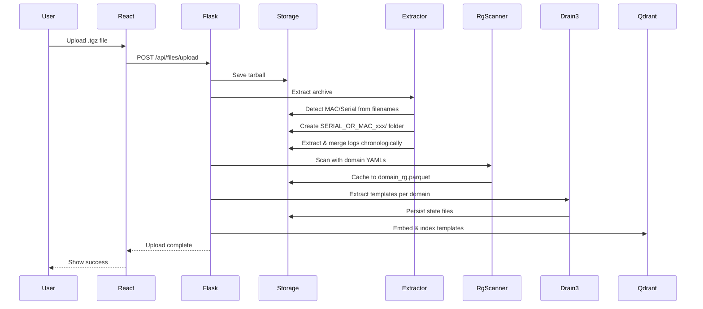
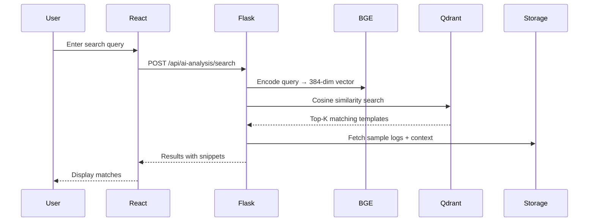
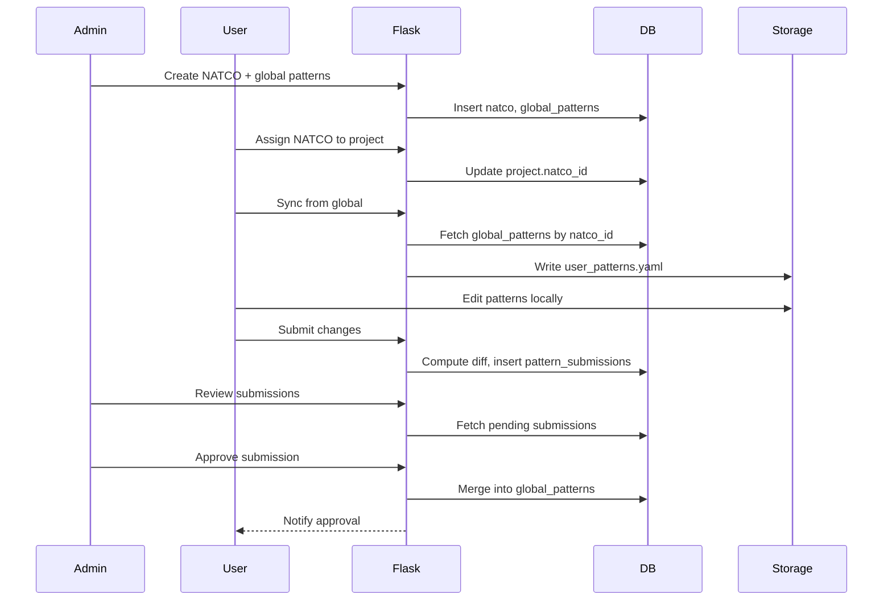
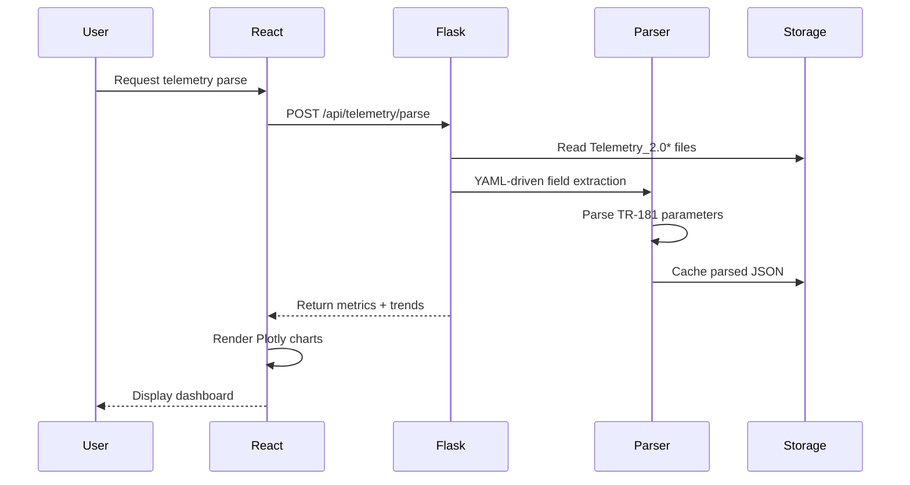
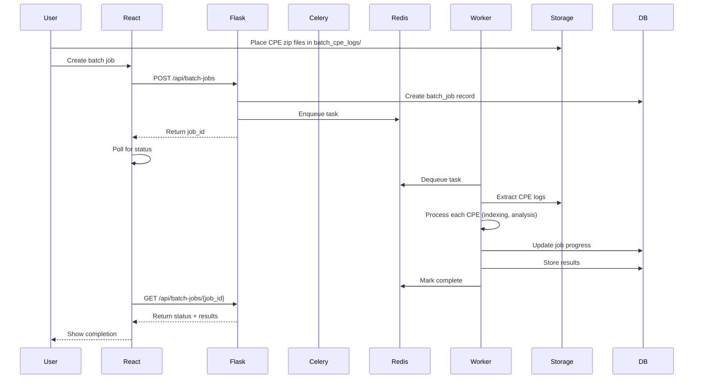
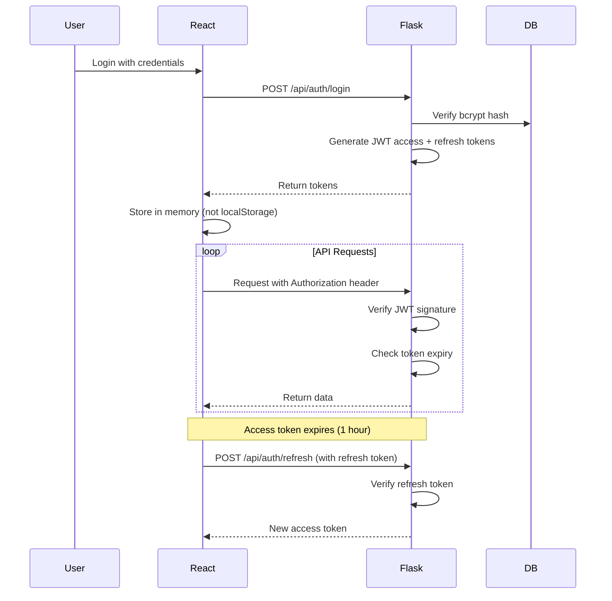

# Architecture

ParseMyLog-AI is built with a modern microservices architecture featuring a React SPA frontend, Flask REST API backend, and specialized data stores for different concerns.

## System Architecture

```
┌────────────────────────────────────────────────────────────────┐
│                    Client Browser                              │
│                  http://localhost:40901                        │
└─────────────────────────┬──────────────────────────────────────┘
                          │
                          ▼
┌────────────────────────────────────────────────────────────────┐
│                     Nginx (Port 80)                            │
│  ┌──────────────────┐        ┌──────────────────────────┐      │
│  │  Static Files    │        │    /api/* Proxy          │      │
│  │  (React SPA)     │        │    → Flask API:5000      │      │
│  └──────────────────┘        └──────────────────────────┘      │
└───────────────────┬──────────────────────┬─────────────────────┘
                    │                      │
         ┌──────────▼──────────┐  ┌────────▼─────────────────────┐
         │   React Frontend    │  │   Flask API (Gunicorn)       │
         │   (Vite + TS)       │  │   4 workers, port 5000       │
         │   Material UI       │  │   JWT Auth + CORS            │
         └─────────────────────┘  └──────────┬───────────────────┘
                                             │
              ┌──────────────────────────────┼──────────────────────┐
              │                              │                      │
    ┌─────────▼──────────┐      ┌───────────▼──────┐    ┌───────────▼──────────┐
    │   SQLite Database  │      │  Qdrant Vector   │    │   Redis (Celery)     │
    │   - Users          │      │   Collections    │    │   Message Broker     │
    │   - Projects       │      │   Per-project    │    │   Port 6379          │
    │   - NATCOs         │      │   + CPE          │    └───────────┬──────────┘
    │   - Submissions    │      │   Port 6333      │                │
    │   /app/data/       │      │   BGE embeddings │                │
    └────────────────────┘      └──────────────────┘    ┌───────────▼──────────┐
                                                        │  Celery Worker       │
    ┌──────────────────────────────────────────────┐    │  Batch Processing    │
    │         File Storage (Volumes)               │    │  Concurrency: 1      │
    │  - user_uploads/     (logs, extracts, cache) │    └──────────────────────┘
    │  - bge_model/        (embedding model)       │
    │  - batch_cpe_logs/   (batch job inputs)      │
    └──────────────────────────────────────────────┘
```

## Component Details

### Frontend Layer

**Technology Stack:**

- **React 19** with TypeScript for type safety
- **Vite** for fast builds and HMR
- **Material UI (MUI)** v7 for component library
- **TanStack Query** (React Query) for server state management
- **React Router v7** for client-side routing
- **Plotly.js** for interactive data visualizations
- **Tailwind CSS v4** for utility-first styling
- **Axios** for HTTP requests with interceptors

**Key Features:**

- JWT-based authentication with automatic token refresh
- Per-project and per-CPE context management
- Real-time progress tracking for async operations
- Responsive design with mobile support
- Code-splitting and lazy loading for optimal performance

### Backend Layer

**Technology Stack:**

- **Flask 3.1** REST API framework
- **Gunicorn** WSGI server (4 workers, 900s timeout)
- **Flask-JWT-Extended** for stateless authentication
- **Flask-CORS** for cross-origin requests
- **SQLAlchemy 2.0** ORM with SQLite
- **Celery 5.4** for async task processing
- **Redis 7** as message broker

**API Design:**

- RESTful endpoints with JWT protection
- Blueprint-based modular architecture
- Request validation with Pydantic
- Consistent error handling and logging
- Health check endpoints for monitoring

### Data Storage Layer

#### 1. SQLite Database (`/app/data/logai_users.db`)

**Tables:**


| Table                 | Purpose            | Key Columns                                  |
| --------------------- | ------------------ | -------------------------------------------- |
| `users`               | User accounts      | id, username, password_hash, is_admin        |
| `projects`            | User projects      | id, user_id, name, natco_id, created_at      |
| `project_files`       | Uploaded files     | id, project_id, filename, path, size         |
| `project_cpes`        | Detected CPEs      | id, project_id, cpe_identifier, source_file  |
| `natcos`              | Deployment configs | id, code, name, description                  |
| `global_patterns`     | NATCO patterns     | id, natco_id, domain, name, regex, enabled   |
| `pattern_submissions` | User submissions   | id, user_id, project_id, change_type, status |
| `conversations`       | Chat history       | id, project_id, cpe_id, title                |
| `chat_messages`       | Chat messages      | id, conversation_id, role, content           |
| `batch_jobs`          | Async jobs         | id, user_id, status, progress, result        |
| `ml_models`           | Trained models     | id, project_id, model_type, metrics          |
| `feedback_labels`     | User annotations   | id, project_id, feedback_type, label         |


**Relationships:**

```
User 1:N Project
Project 1:N ProjectFile
Project 1:N ProjectCPE
Project N:1 Natco
Natco 1:N GlobalPattern
Project 1:N PatternSubmission
Project 1:N Conversation
Project 1:N BatchJob
Project 1:N MLModel
```

#### 2. Qdrant Vector Database

**Purpose:** Store and search log pattern embeddings

**Collection Naming:** `project_{project_id}_cpe_{cpe_id}`

**Vector Specifications:**

- **Model:** BAAI/bge-small-en-v1.5
- **Dimensions:** 384
- **Distance Metric:** Cosine similarity
- **Payload Fields:**
  - `template`: Drain3 template string
  - `domain`: Log domain (wifi, platform, cellular, etc.)
  - `frequency`: Occurrence count
  - `sample_logs`: Example log lines
  - `timestamp`: Index timestamp

**Indexing Strategy:**

1. Per-domain Drain3 template extraction
2. ripgrep pre-filtering (6-10x speedup)
3. BGE embedding generation
4. Batch upsert to Qdrant (chunk size: 100)

#### 3. File Storage

**Volume Mounts:**


| Volume           | Path                            | Purpose                                |
| ---------------- | ------------------------------- | -------------------------------------- |
| `user_uploads`   | `/app/user_uploads/`            | Uploaded logs, extracted files, caches |
| `bge_model`      | `/app/bge-small-en-v1.5-local/` | Cached embedding model                 |
| `batch_cpe_logs` | `/app/batch_cpe_logs/`          | Batch job input directory              |
| `logai_data`     | `/app/data/`                    | SQLite database                        |
| `frontend_dist`  | `/usr/share/nginx/html/`        | Built React SPA                        |
| `qdrant_storage` | `/qdrant/storage/`              | Qdrant persisted data                  |
| `redis_data`     | `/data/`                        | Redis AOF persistence                  |


**Upload Directory Structure:**

```
user_uploads/
└── user_{user_id}/
    └── project_{project_id}/
        ├── uploads/
        │   └── {original_tarball}.tgz
        ├── SERIAL_OR_MAC_{cpe_identifier}/
        │   ├── merged_logs.txt        # Chronologically merged
        │   ├── files/                 # Extracted log files
        │   ├── domain_rg.parquet      # Pre-filtered cache
        │   ├── drain3_state_{domain}.bin
        │   └── reboot_events.json
        └── user_patterns.yaml          # Per-project overrides
```

## Data Flow Pipelines

### 1. Log Upload & Processing Pipeline




### 2. Semantic Search Pipeline




### 3. Pattern Governance Pipeline




### 4. Telemetry Processing Pipeline




### 5. Batch CPE Processing Pipeline




## Security Architecture

### Authentication Flow




**Security Measures:**

- Passwords hashed with bcrypt (salt rounds: 12)
- JWT tokens with HMAC-SHA256 signatures
- Access tokens expire in 1 hour
- Refresh tokens expire in 30 days
- CORS restricted to configured origins
- Per-user data isolation in file system
- SQL injection prevention via SQLAlchemy ORM
- Admin-only routes protected with `@admin_required`

### Authorization Model

**Roles:**

- **Admin:** Full access to all resources, user management, NATCO management
- **User:** Access to own projects only

**Project Isolation:**

```python
@jwt_required()
def get_project(project_id):
    user_id = get_jwt_identity()
    project = Project.query.filter_by(
        id=project_id, 
        user_id=user_id
    ).first_or_404()
    return project
```

**Admin Check:**

```python
def admin_required():
    @wraps(fn)
    def wrapper(*args, **kwargs):
        user_id = get_jwt_identity()
        user = User.query.get(user_id)
        if not user or not user.is_admin:
            return {"error": "Admin access required"}, 403
        return fn(*args, **kwargs)
    return wrapper
```

## Scalability Considerations

### Current Design (Single-Node)

**Bottlenecks:**

- Gunicorn workers (4): CPU-bound embedding generation
- Single Celery worker: Sequential batch job processing
- SQLite: No concurrent writes (read scaling OK)

**Optimal For:**

- 1-10 concurrent users
- 100s of projects
- 1000s of CPE devices
- Moderate upload frequency (<10/hour)

### Future Scaling Paths

**Horizontal Scaling (Multi-Node):**

1. **Replace SQLite with PostgreSQL**
  - Concurrent write support
  - Connection pooling
  - Replication for read scaling
2. **Increase Celery Workers**
  - Deploy workers on multiple machines
  - Redis Cluster for high-throughput message queue
3. **Add API Load Balancer**
  - Nginx upstream with multiple Gunicorn instances
  - Session affinity not needed (stateless JWT)
4. **Qdrant Cluster Mode**
  - Distributed collections with sharding
  - Replica sets for fault tolerance
5. **Distributed File Storage**
  - Replace local volumes with S3/MinIO
  - CDN for frontend assets

**Vertical Scaling (Single-Node):**

- Increase Gunicorn workers (1 per CPU core)
- Increase Celery concurrency (with `-c` flag)
- Use GPU for embedding generation (10x faster)
- Increase RAM for larger Drain3 state files

## Monitoring & Observability

### Health Checks

**API Health:**

```bash
curl http://localhost:40901/api/auth/health
```

**Service Health:**

```bash
docker compose ps
```

**Qdrant Health:**

```bash
curl http://localhost:6333/health
```

**Redis Health:**

```bash
docker exec logai-redis redis-cli ping
```

### Logging

**Log Format:**

```
HH:MM:SS [module.name] LEVEL: message
```

**Log Levels:**

- `DEBUG`: Detailed diagnostic info
- `INFO`: General operational messages
- `WARNING`: Potential issues
- `ERROR`: Serious problems

**Viewing Logs:**

```bash
# All services
docker compose logs -f

# Specific service
docker compose logs -f logai-api

# Last 100 lines
docker compose logs --tail 100 logai-api

# Search logs
docker compose logs logai-api | grep ERROR
```

### Performance Metrics

**Key Metrics to Monitor:**


| Metric            | Description                            | Threshold                  |
| ----------------- | -------------------------------------- | -------------------------- |
| API Response Time | P95 latency for endpoints              | <2s (search), <5s (upload) |
| Embedding Time    | Per-template embedding generation      | <50ms                      |
| Index Time        | Full project indexing (1000 templates) | <5min                      |
| CPU Usage         | Gunicorn + Celery workers              | <80% sustained             |
| Memory Usage      | API + Qdrant + Redis                   | <8GB total                 |
| Disk I/O          | Upload extraction + parquet writes     | <100MB/s                   |
| Qdrant Query Time | Vector search latency                  | <100ms                     |


## Development Architecture

### Local Development Setup

```
┌─────────────────────────────────────────────────────────────┐
│                    Developer Machine                        │
│  ┌──────────────────────┐     ┌─────────────────────────┐   │
│  │  React Dev Server    │     │  Flask Dev Server       │   │
│  │  Vite HMR            │     │  run_api.py             │   │
│  │  Port 5173           │     │  Port 40901             │   │
│  │  Proxy /api → 40901  │────▶│  Auto-reload on change  │   │
│  └──────────────────────┘     └───────────┬─────────────┘   │
│                                           │                 │
│                                 ┌─────────▼──────────┐      │
│                                 │  Docker Qdrant     │      │
│                                 │  Port 6333         │      │
│                                 └────────────────────┘      │
└─────────────────────────────────────────────────────────────┘
```

**Start Development:**

```bash
# Start Qdrant + Redis
docker compose up qdrant redis -d

# Start both frontend + backend
python run_dev.py

# Or separately:
# Backend: python run_api.py
# Frontend: cd frontend && npm run dev
```

**Hot Reload:**

- Frontend: Vite HMR (instant)
- Backend: Flask auto-reload (2-3s)

### Testing Strategy

**Backend Tests:**

```bash
pytest api/tests/          # Unit tests
pytest api/tests/integration/  # Integration tests
```

**Frontend Tests:**

```bash
cd frontend
npm run test              # Jest unit tests
npm run test:e2e          # Playwright E2E tests
```

**API Testing:**

```bash
# Manual testing with curl
curl -X POST http://localhost:40901/api/auth/login \
  -H "Content-Type: application/json" \
  -d '{"username":"admin","password":"admin123"}'
```

## Configuration Management

### Environment Variables

See [Environment Variables](./ENVIRONMENT_VARIABLES.md) for full reference.

**Key Configs:**


| Variable         | Default                                  | Purpose              |
| ---------------- | ---------------------------------------- | -------------------- |
| `APP_PORT`       | 40901                                    | Nginx exposed port   |
| `QDRANT_URL`     | [http://qdrant:6333](http://qdrant:6333) | Vector DB connection |
| `DB_PATH`        | /app/data/logai_users.db                 | SQLite location      |
| `JWT_SECRET_KEY` | auto-generated                           | Token signing key    |
| `LOG_LEVEL`      | INFO                                     | Python logging level |
| `REDIS_URL`      | redis://redis:6379/0                     | Celery broker        |


### Configuration Files


| File                                   | Purpose                                                |
| -------------------------------------- | ------------------------------------------------------ |
| `drain3.ini`                           | Drain3 parser parameters (sim_th, depth, max_clusters) |
| `configs/rg_patterns/*.yaml`           | Domain-specific ripgrep patterns                       |
| `configs/telemetry_report_fields.yaml` | TR-181 field extraction rules                          |
| `.env`                                 | Environment variable overrides                         |
| `nginx/default.conf`                   | Nginx routing rules                                    |


## Related Documentation

- [Features Overview](./FEATURES.md)
- [Developer Quick Start](./QUICK_START.md)
- [API Reference](./API_REFERENCE.md)
- [Deployment Guide](./DEPLOYMENT.md)

