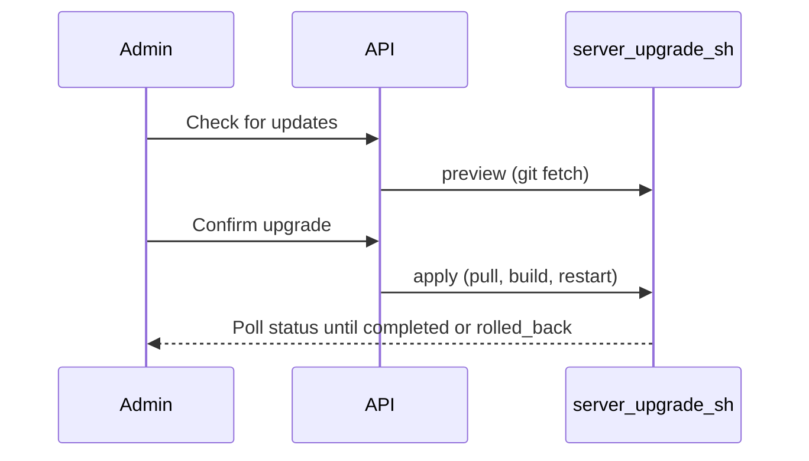

# In-app deployment update (admin)

## Overview

Production servers can be upgraded from the admin UI without SSH. The flow previews incoming commits, requires explicit confirmation, then runs the same steps as manual deployment.

## Access

- **Who:** Users with `is_admin` only
- **Where:** Admin panel → Settings tab → Application Update card
- **API:** `POST /api/admin/deployment/preview`, `POST /api/admin/deployment/apply`, `GET /api/admin/deployment/status`
- **Version:** Shown from the repo root `VERSION` file (same source as `GET /api/version`)

## Configuration

| Variable | Default | Description |
|----------|---------|-------------|
| `DEPLOY_UPDATE_ENABLED` | `0` | Set to `1` to enable UI and API |
| `DEPLOY_PROJECT_ROOT` | `/deploy` | Git and compose working directory inside the container |
| `DEPLOY_STATUS_FILE` | `/app/data/deploy_update_status.json` | Job status (persisted in `logai_data` volume) |
| `APP_PORT` | `40901` | Used for post-restart health checks |

## Flow

## Rollback

Before `git pull`, the script stores `pre_sha`. If pull, frontend build, restart, or health check fails, it:

1. `git reset --hard <pre_sha>`
2. Rebuilds frontend
3. Restarts `nginx`, `celery-worker`, `logai-api`

## Related files

- `scripts/server-upgrade.sh` — orchestration script
- `api/services/deployment_update.py` — API service
- `api/routes/admin.py` — admin endpoints
- `frontend/src/components/admin/DeploymentUpdateCard.tsx` — UI
